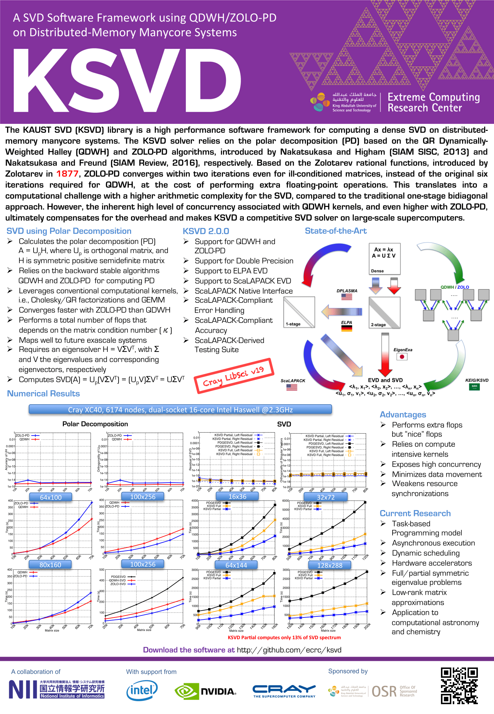

KSVD
================
**The KAUST SVD (KSVD) is a high performance software framework for computing a dense SVD on distributed-memory manycore systems.**
The KSVD solver relies on the polar decomposition (PD) based on the QR Dynamically-Weighted Halley (QDWH) and ZOLO-PD algorithms, introduced by Nakatsukasa and Higham (SIAM SISC, 2013) and Nakatsukasa and Freund (SIAM Review, 2016), respectively. Based on the Zolotarev rational functions, introduced by Zolotarev in 1877, ZOLO-PD converges within two iterations even for ill-conditioned matrices, instead of the original six iterations required for QDWH, at the cost of performing extra floating-point operations. This translates into a computational challenge with a higher arithmetic complexity for the SVD, compared to the traditional one-stage bidiagonal approach. However, the inherent high level of concurrency associated with QDWH kernels, and even higher with ZOLO-PD, ultimately compensates for the overhead and makes KSVD a competitive SVD solver on large-scale supercomputers.

Current Features of KSVD
===========================

- QDWH-based Polar Decomposition
- ZOLOPD-based Polar Decomposition
- Support double precision
- Support dense two-dimensional block cyclic data distribution
- Support Support to ELPA Symmetric Eigensolver
- Support Support to ScaLAPACK D&C and MR3 Symmetric Eigensolvers
- ScaLAPACK Interface / Native Interface
- ScaLAPACK-Compliant Error Handling
- ScaLAPACK-Derived Testing Suite
- ScaLAPACK-Compliant Accuracy
 
Programming models (backends) and dependencies:
1.  MPI
2.  ScaLAPACK
3.  Polar decomposition (https://github.com/ecrc/polar)

Installation
============

Installation requires at least **CMake** of version 3.2.3. To build KSVD,
follow these instructions:

1.  Get KSVD from git repository

        git clone git@github.com:ecrc/ksvd

2.  Go into KSVD folder

        cd ksvd

3.  Create build directory and go there

        mkdir build && cd build

4.  Use CMake to get all the dependencies

        cmake .. -DCMAKE_INSTALL_PREFIX=/path/to/install/

5.  To build the testing binaries (optional)

        cmake .. -DCMAKE_INSTALL_PREFIX=/path/to/install/ -DKSVD_TESTING:BOOL=ON 

6.  Use CMake to build KSVD based on existing installations of the dependencies

        cmake .. -DCMAKE_INSTALL_PREFIX=/path/to/install/ -DKSVD_TESTING:BOOL=ON -DPOLAR_DIR=/path/to/polar/installation -DSCALAPACK_DIR=/path/to/scalapack/installation -DSLTMG_LIBRARIES=/path/to/scalapack/installation/lib/libsltmg.a

7.  Build KSVD

        make -j

8.  Install KSVD

        make install

9. Add line

        export PKG_CONFIG_PATH=/path/to/install/lib/pkgconfig:$PKG_CONFIG_PATH

    to your .bashrc file.

Now you can use pkg-config executable to collect compiler and linker flags for
KSVD.

Testing and Timing
==================

The directories testing and timing contain an example 
to test the accuracy and the performance of KSVD using
ill and well-conditioned random matrices.

   The complete list of options is available below with -h option:
  
  ```
     "======= KSVD testing using ScaLAPACK\n"
            " -p      --nprow         : Number of MPI process rows\n"
            " -q      --npcol         : Number of MPI process cols\n"
            " -jl     --lvec          : Compute left singular vectors\n"
            " -jr     --rvec          : Compute right singular vectors\n"
            " -n      --N             : Dimension of the matrix\n"
            " -b      --nb            : Block size\n"
            " -m      --mode          : [1:6] Mode from pdlatms used to generate the matrix\n"
            " -k      --cond          : Condition number used to generate the matrix\n"
            " -o      --optcond       : Estimate Condition number using QR\n"
            " -i      --niter             : Number of iterations\n"
            " -r      --n_range           : Range for matrix sizes Start:Stop:Step\n"
            " -polarqdwh --polarqdwh      : Find polar decomposition using QDWH A=UH \n"
            " -polarzolopd --polarzolopd  : Find polar decomposition using ZOLO-PD A=UH \n"
            " -polarsvd  --polarsvd       : Find the polar decomposition using scalapack-svd \n"
            " -s      --slsvd             : Run reference ScaLAPACK SVD\n"
            " -w      --ksvdmr            : Run KSVD with ScaLAPACK MRRR EIG\n"
            " -e      --ksvddc            : Run KSVD with ScaLAPACK DC EIG\n"
            " -l      --ksvdel            : Run KSVD with ScaLAPACK DC EIG\n"
            " -c      --check             : Check the solution\n"
            " -fksvd --profksvd           : Enable profiling KSVD\n"
            " -v      --verbose           : Verbose\n"
            " -h      --help              : Print this help\n" );
```
     On Cray systems, the launching command typically looks like:
    
       srun --ntasks=nT --hint=nomultithread ./main --nprow p --npcol q --b 64 --cond 1e16 --niter 1 --n_range start:stop:step --check --qwmr --qwdc --qwel --slsvd

     1. The number of the nodes is N, the number of tasks (nT) = N * (number_of_cores per node ). The programming model is pure MPI (no OpenMP, i.e., sequential BLAS).
     2. PxQ is the process grid configuration, where (nT - PxQ = 0)
     3. To compute the SVD decomposition using KSVD, the polar decomposition is calculated first, then followed by MRRR (--qwmr) or 
	 DC (--qwdc) or ELPA-DC (--qwel), as various alternatives for the symmetric eigensolvers.
     4. To use the regular bidiagonal reduction SVD from ScaLAPACK PDGESVD: --slsvd


TODO List
=========

1.  Add support for the other precisions 
2.  Extend to task-based programming model
3.  Port to various dynamic runtime systems (e.g., PaRSEC)
4.  Provide symmetric eigensolvers


References
==========
1. H. Ltaief, D. Sukkari, A. Esposito, Y. Nakatsukasa and D. Keyes, Massively Parallel 
Polar Decomposition on Distributed-Memory Systems, *Submitted to IEEE Transactions on 
Parallel Computing TOPC*, http://hdl.handle.net/10754/626359.1, 2018.
2. D. Sukkari, H. Ltaief, A. Esposito and D. Keyes, A QDWH-Based SVD Software Framework on
Distributed-Memory Manycore Systems, *Submitted to ACM Transactions on Mathematical Software TOMS*, 
http://hdl.handle.net/10754/626212, 2017.
3. D. Sukkari, H. Ltaief, M. Faverge, and D. Keyes, Asynchronous Task-Based Polar
Decomposition on Massively Parallel Systems, *IEEE Transactions on Parallel and 
Distributed Systems TPDS*, volume 29, pages 312–323, https://ieeexplore.ieee.org/document/8053812/, 2017.
4. D. Sukkari, H. Ltaief and D. Keyes, A High Performance QDWH-SVD Solver using
Hardware Accelerators, *ACM Transactions on Mathematical Software TOMS*, vol. 43 (1), pp. 1-25, 2016.
5. D. Sukkari, H. Ltaief and D. Keyes, High Performance Polar Decomposition for SVD
Solvers on Distributed Memory Systems, Best Papers, *Proceedings of the 22nd International 
Euro-Par Conference*, https://doi.org/10.1007/978-3-319-43659-3_44, 2016.
6. D.Sukkari, H. Ltaief and D. Keyes, A High Performance QDWH-SVD Solver using 
Hardware Accelerators, *ACM Transactions on Mathematical Software TOMS*, 
http://doi.acm. org/10.1145/2894747, volume 43, pages 6:1–6:25, 2016.
7. Y. Nakatsukasa and N. J. Higham, Stable and Efficient Spectral Divide and Conquer 
Algorithms for the Symmetric Eigenvalue Decomposition and the SVD, *SIAM Journal on Scientific Computing*,
vol. 35, no. 3, pp. A1325–A1349, http://epubs.siam.org/doi/abs/10.1137/120876605, 2013.
8. Y. Nakatsukasa, R. Freund, using Zolotarev's Rational Approximation for Computing the Polar, 
Symmetric Eigenvalue, and Singular Value Decompositions, *SIAM Review*, 
https://books.google.com.sa/books?id=a9d7rgEACAAJ, 2016.


Questions?
==========
Please feel free to create an issue on Github for any questions and inquiries.




