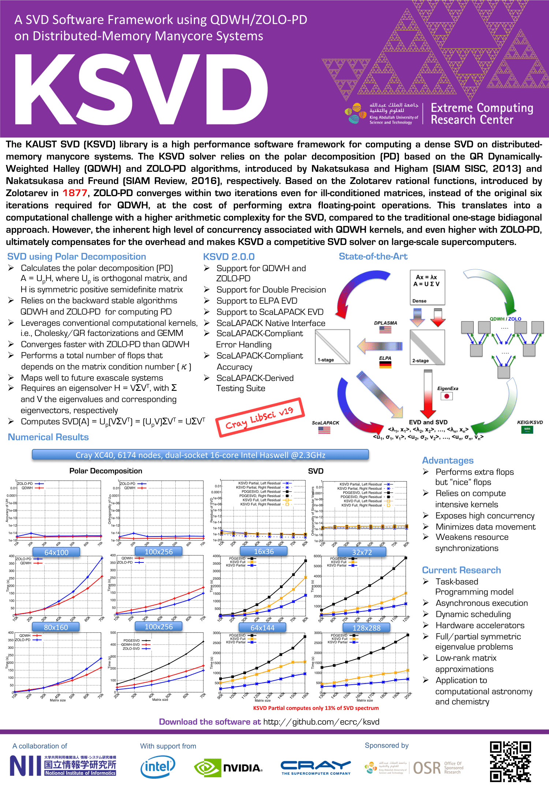

@mainpage KSVD documentation

KSVD
================
**The KAUST SVD (KSVD) is a high performance software framework for computing a dense SVD on distributed-memory manycore systems.**
The KSVD solver relies on the polar decomposition (PD) based on the QR Dynamically-Weighted Halley (QDWH) and ZOLO-PD algorithms, introduced by Nakatsukasa and Higham (SIAM SISC, 2013) and Nakatsukasa and Freund (SIAM Review, 2016), respectively. Based on the Zolotarev rational functions, introduced by Zolotarev in 1877, ZOLO-PD converges within two iterations even for ill-conditioned matrices, instead of the original six iterations required for QDWH, at the cost of performing extra floating-point operations. This translates into a computational challenge with a higher arithmetic complexity for the SVD, compared to the traditional one-stage bidiagonal approach. However, the inherent high level of concurrency associated with QDWH kernels, and even higher with ZOLO-PD, ultimately compensates for the overhead and makes KSVD a competitive SVD solver on large-scale supercomputers.

Current Features of KSVD
===========================

- QDWH-based Polar Decomposition
- ZOLOPD-based Polar Decomposition
- Support double precision
- Support dense two-dimensional block cyclic data distribution
- Support Support to ELPA Symmetric Eigensolver
- Support Support to ScaLAPACK D&C and MR3 Symmetric Eigensolvers
- ScaLAPACK Interface / Native Interface
- ScaLAPACK-Compliant Error Handling
- ScaLAPACK-Derived Testing Suite
- ScaLAPACK-Compliant Accuracy
 
Programming models (backends) and dependencies:
1.  MPI
2.  ScaLAPACK
3.  Polar decomposition (https://github.com/ecrc/polar)

TODO List
=========

1.  Add support for the other precisions 
2.  Extend to task-based programming model
3.  Port to various dynamic runtime systems (e.g., PaRSEC)
4.  Provide symmetric eigensolvers

References
==========
1. H. Ltaief, D. Sukkari, A. Esposito, Y. Nakatsukasa and D. Keyes, Massively Parallel 
Polar Decomposition on Distributed-Memory Systems, *Submitted to IEEE Transactions on 
Parallel Computing TOPC*, http://hdl.handle.net/10754/626359.1, 2018.
2. D. Sukkari, H. Ltaief, A. Esposito and D. Keyes, A QDWH-Based SVD Software Framework on
Distributed-Memory Manycore Systems, *Submitted to ACM Transactions on Mathematical Software TOMS*, 
http://hdl.handle.net/10754/626212, 2017.
3. D. Sukkari, H. Ltaief, M. Faverge, and D. Keyes, Asynchronous Task-Based Polar
Decomposition on Massively Parallel Systems, *IEEE Transactions on Parallel and 
Distributed Systems TPDS*, volume 29, pages 312–323, https://ieeexplore.ieee.org/document/8053812/, 2017.
4. D. Sukkari, H. Ltaief and D. Keyes, A High Performance QDWH-SVD Solver using
Hardware Accelerators, *ACM Transactions on Mathematical Software TOMS*, vol. 43 (1), pp. 1-25, 2016.
5. D. Sukkari, H. Ltaief and D. Keyes, High Performance Polar Decomposition for SVD
Solvers on Distributed Memory Systems, Best Papers, *Proceedings of the 22nd International 
Euro-Par Conference*, https://doi.org/10.1007/978-3-319-43659-3_44, 2016.
6. D.Sukkari, H. Ltaief and D. Keyes, A High Performance QDWH-SVD Solver using 
Hardware Accelerators, *ACM Transactions on Mathematical Software TOMS*, 
http://doi.acm. org/10.1145/2894747, volume 43, pages 6:1–6:25, 2016.
7. Y. Nakatsukasa and N. J. Higham, Stable and Efficient Spectral Divide and Conquer 
Algorithms for the Symmetric Eigenvalue Decomposition and the SVD, *SIAM Journal on Scientific Computing*,
vol. 35, no. 3, pp. A1325–A1349, http://epubs.siam.org/doi/abs/10.1137/120876605, 2013.
8. Y. Nakatsukasa, R. Freund, using Zolotarev's Rational Approximation for Computing the Polar, 
Symmetric Eigenvalue, and Singular Value Decompositions, *SIAM Review*, 
https://books.google.com.sa/books?id=a9d7rgEACAAJ, 2016.
Questions?
==========
Please feel free to create an issue on Github for any questions and inquiries.

